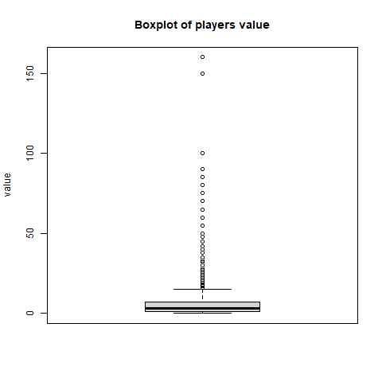

# Pràctica 2: Neteja i anàlisi de les dades

- [Pràctica 2: Neteja i anàlisi de les dades](#pràctica-2-neteja-i-anàlisi-de-les-dades)
  - [1. Descripció del dataset](#1-descripció-del-dataset)
    - [Descripció](#descripció)
    - [Objectiu de l'anàlisi del dataset](#objectiu-de-lanàlisi-del-dataset)
  - [2. Integració i selecció de les dades d’interès a analitzar](#2-integració-i-selecció-de-les-dades-dinterès-a-analitzar)
    - [Selecció de variables (columnnes) i conversions](#selecció-de-variables-columnnes-i-conversions)
    - [Selecció de jugadors (files)](#selecció-de-jugadors-files)
  - [3. Neteja de les dades](#3-neteja-de-les-dades)
    - [3.1. Dades amb zeros i elements buits](#31-dades-amb-zeros-i-elements-buits)
    - [3.2. Identificació i tractament de valors extrems](#32-identificació-i-tractament-de-valors-extrems)
  - [4. Anàlisi de les dades.](#4-anàlisi-de-les-dades)
    - [4.1. Selecció dels grups de dades que es volen analitzar/comparar](#41-selecció-dels-grups-de-dades-que-es-volen-analitzarcomparar)
    - [4.2. Comprovació de la normalitat i homogeneïtat de la variància.](#42-comprovació-de-la-normalitat-i-homogeneïtat-de-la-variància)
    - [4.3. Aplicació de proves estadístiques per comparar els grups de dades.](#43-aplicació-de-proves-estadístiques-per-comparar-els-grups-de-dades)
  - [5. Representació dels resultats a partir de taules i gràfiques.](#5-representació-dels-resultats-a-partir-de-taules-i-gràfiques)
  - [6. Resolució del problema.](#6-resolució-del-problema)
  - [7. Codi](#7-codi)

| | |
|-|-|
| Títol | Pràctica 2: Neteja i anàlisi de les dades |
| Autor | Celio |
| Autor | Jose |
| Assignatura | Tipologia i Cicle de Vida de les Dades |
| Data | 04-Gener-2021 |

## 1. Descripció del dataset

### Descripció

Dataset original: 

* Fitxer: `data/transfermarkt.csv`


    > fitxer_ruta <- '../data/transfermarkt.csv'
    > dades <- read.csv(fitxer_ruta)


* Descripció: és el resultat de la pràctica #1

Aquest dataset consisteix en...

Tipus de dades de les columnes.

| column           | type      | Nota |
|------------------|-----------|------|
| position_id      | integer   | 
| position_ranking | integer   | 
| player           | character | 
| url              | character | 
| position         | character | 
| age              | character | 
| country          | character | 
| club             | character | 
| value            | integer   | 
| matches          | integer   | 
| goals            | integer   | 
| owngoals         | integer   | 
| assists          | integer   | 
| yellowcards      | integer   | 
| yellow2cards     | integer   | 
| redcards         | integer   | 
| subston          | integer   | 
| substoff         | integer   | 

### Objectiu de l'anàlisi del dataset

Volem esbrinar si el valor (`value`) de traspàs que assigna aquesta web té alguna correlació o valor predictiu sobre la efectivitat ofensiva dels jugadors. Atès que no tenim accés a totes les variables que utilitza el proveïdor de les dades per determinear el valor de traspàs d'un jugador, volem fer l'anàlisi inversa: el valor assignat és un bon predictor de les característiques ofensives (`goals` i `assists`) d'un jugador? També volem determinar el pes d'altres variables (país, club, edat) en aquest anàlisi.

## 2. Integració i selecció de les dades d’interès a analitzar

### Selecció de variables (columnnes) i conversions

Prescindim d'aquestes variables ja que no són rellevant per l'anàlisi a realitzar:

- `url`: URL del jugador en la web de Transfermarkt.com
- `owngoals` (els gols en pròpia porta): creiem que no tenen relació amb el valor d'un jugador, ja que es tracta d'una circumnstància de joc prou aleatòria.
- També deixem fora les targetes (grogues i vermelles) i explulsions, ja que no creiem que siguen significatives tenint sols les dades de mitja temporada, i atès que el que ens interessa són les dades ofensives:
  - `yellowcards` 
  - `yellow2cards`
  - `redcards`

```
> players <- dades %>% select(-url, -owngoals, -yellowcards, -yellow2cards, -redcards)
```

Aquest són les variables que tindrem en compte: 
- position_id
- position_ranking
- player
- position
- age
- country
- club
- value
- matches
- goals
- assists
- subston
- substoff

Com que el tipus de les dades de la columna `age` està com caràcter, cal fer una conversió a tipus numèric (`integer`). 

    > class(players$age)
    [1] "character"
    > players$age <- as.integer(players$age)
    Warning message:
    NAs introduced by coercion

Aquesta conversió genera un valors desconeguts (NA) per a la variable edat, que taractarem al següent apartat.

També fem una tranformació del camp `value` que indica el valor de traspàs en euros (€). Anem a transformar-lo en milions d'euros (dividint entre 1.000.000).


    > players$value <- players$value / 1e6

### Selecció de jugadors (files)

Seleccionem sols els jugadors que tenen partits disputats, ja que els sobre els jugadors que no han jugat no s'aporta cap dada. 

    > players <- players[!players$matches == 0,]

## 3. Neteja de les dades

### 3.1. Dades amb zeros i elements buits

En el l'apartat aterior ja hem fet una selecció per excloure del dataset les files sense dades, es a dir, les que corresponen a jugadors no havien disputat partits (`matches` == 0), ja que no són aporten dades per l'anàlisi a realitzar.

Deprés de fer la conversió del camp d'etat (`age`) a numèric (`integer`) hem revisat les dades amb elements que no s'han pogut convertir (NA) i, com tan sols es tracta de 2 files, les hem descartades.

    > players <- players[!is.na(players$age), ]

La resta d'elements amb valor 0 corresponen a les estadístiques normals de jugadors que no han marcat gols, ni han assitències, ni han sigut substituïts. 

### 3.2. Identificació i tractament de valors extrems

Aquestes són les variables numèriques:

    > columns <- c("age", "value", "matches", "goals", "assists", "subston", "substoff")


Per a revisar les valors extrem comprovem les estadístiques de cada variable numèrica:

    > for (column in columns) {
    +     print(paste("summary(players$", column, ")", sep =""))
    +     print(summary(players[[column]]))
    + }

Resultats:

    [1] "summary(players$age)"
    Min. 1st Qu.  Median    Mean 3rd Qu.    Max. 
    16.00   23.00   25.00   25.58   28.00   43.00 
    [1] "summary(players$value)"
    Min. 1st Qu.  Median    Mean 3rd Qu.    Max. 
    0.075   1.300   3.000   6.670   6.500 160.000 
    [1] "summary(players$matches)"
    Min. 1st Qu.  Median    Mean 3rd Qu.    Max. 
    1.00   12.00   17.00   16.13   21.00   36.00 
    [1] "summary(players$goals)"
    Min. 1st Qu.  Median    Mean 3rd Qu.    Max. 
    0.000   0.000   1.000   2.004   3.000  30.000 
    [1] "summary(players$assists)"
    Min. 1st Qu.  Median    Mean 3rd Qu.    Max. 
    0.000   0.000   1.000   1.585   2.000  17.000 
    [1] "summary(players$subston)"
    Min. 1st Qu.  Median    Mean 3rd Qu.    Max. 
    0.000   1.000   3.000   3.669   6.000  23.000 
    [1] "summary(players$substoff)"
    Min. 1st Qu.  Median    Mean 3rd Qu.    Max. 
    0.000   1.000   4.000   4.866   7.000  24.000 

Generem gràfics *boxplots* per visualitzar gràficament els *outliers*:

    > for (column in columns) {
    +     title <- paste("Boxplot of players ", column, sep="")
    +     pngfile <- paste("figures/boxplot-", column, ".png", sep="")
    +     png(pngfile)
    +     boxplot(players[[column]], ylab=column, main=title)
    +     dev.off()
    + }

Gràfics *boxplots* per a les variables numèriques: 





## 4. Anàlisi de les dades.

### 4.1. Selecció dels grups de dades que es volen analitzar/comparar 

(planificació dels anàlisis a aplicar).

### 4.2. Comprovació de la normalitat i homogeneïtat de la variància.

### 4.3. Aplicació de proves estadístiques per comparar els grups de dades. 

En funció de les dades i de l’objectiu de l’estudi, aplicar proves de contrast d’hipòtesis, correlacions, regressions, etc. Aplicar almenys tres mètodes d’anàlisi diferents. 

## 5. Representació dels resultats a partir de taules i gràfiques.

## 6. Resolució del problema.

A partir dels resultats obtinguts, quines són les conclusions?
Els resultats permeten respondre al problema?

## 7. Codi

Tot el codi està en la carpeta code del repositori.


