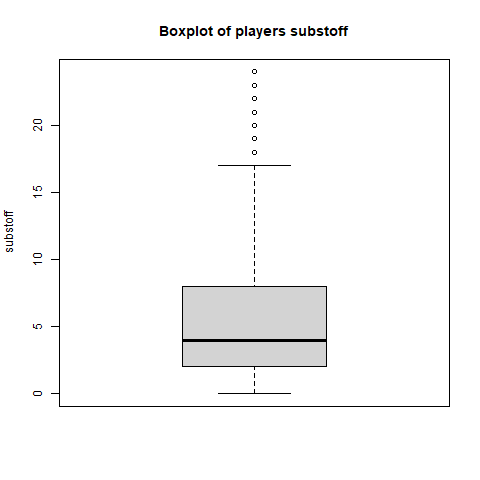

# Pràctica 2: Neteja i anàlisi de les dades

- [Pràctica 2: Neteja i anàlisi de les dades](#pràctica-2-neteja-i-anàlisi-de-les-dades)
  - [1. Descripció del dataset](#1-descripció-del-dataset)
    - [Descripció](#descripció)
    - [Objectiu de l'anàlisi del dataset](#objectiu-de-lanàlisi-del-dataset)
  - [2. Integració i selecció de les dades d’interès a analitzar](#2-integració-i-selecció-de-les-dades-dinterès-a-analitzar)
    - [Selecció de variables (columnnes) i conversions](#selecció-de-variables-columnnes-i-conversions)
    - [Selecció de jugadors (files)](#selecció-de-jugadors-files)
  - [3. Neteja de les dades](#3-neteja-de-les-dades)
    - [3.1. Dades amb zeros i elements buits](#31-dades-amb-zeros-i-elements-buits)
    - [3.2. Identificació i tractament de valors extrems](#32-identificació-i-tractament-de-valors-extrems)
  - [4. Anàlisi de les dades.](#4-anàlisi-de-les-dades)
    - [4.1. Selecció dels grups de dades que es volen analitzar/comparar](#41-selecció-dels-grups-de-dades-que-es-volen-analitzarcomparar)
    - [4.2. Comprovació de la normalitat i homogeneïtat de la variancia.](#42-comprovació-de-la-normalitat-i-homogeneïtat-de-la-variancia)
      - [Comprovació de la normalitat](#comprovació-de-la-normalitat)
      - [Comprovació de l'homoscedasticitat](#comprovació-de-lhomoscedasticitat)
    - [4.3. Aplicació de proves estadístiques per comparar els grups de dades](#43-aplicació-de-proves-estadístiques-per-comparar-els-grups-de-dades)
  - [5. Representació dels resultats a partir de taules i gràfiques](#5-representació-dels-resultats-a-partir-de-taules-i-gràfiques)
  - [6. Resolució del problema](#6-resolució-del-problema)
  - [7. Codi](#7-codi)

| | |
|-|-|
| Títol | Pràctica 2: Neteja i anàlisi de les dades |
| Autor | Celio |
| Autor | Jose |
| Assignatura | Tipologia i Cicle de Vida de les Dades |
| Data | 04-Gener-2021 |

## 1. Descripció del dataset

### Descripció

Dataset original: 

* Fitxer: `data/transfermarkt.csv`


    > fitxer_ruta <- '../data/transfermarkt.csv'
    > dades <- read.csv(fitxer_ruta)


* Descripció: és el resultat de la pràctica #1

Aquest dataset consisteix en...

Tipus de dades de les columnes.

| column           | type      | Nota |
|------------------|-----------|------|
| position_id      | integer   | 
| position_ranking | integer   | 
| player           | character | 
| url              | character | 
| position         | character | 
| age              | character | 
| country          | character | 
| club             | character | 
| value            | integer   | 
| matches          | integer   | 
| goals            | integer   | 
| owngoals         | integer   | 
| assists          | integer   | 
| yellowcards      | integer   | 
| yellow2cards     | integer   | 
| redcards         | integer   | 
| subston          | integer   | 
| substoff         | integer   | 

### Objectiu de l'anàlisi del dataset

Volem esbrinar si el valor (`value`) de traspàs que assigna aquesta web té alguna correlació o valor predictiu sobre l'efectivitat ofensiva dels jugadors. Atès que no tenim accés a totes les variables que utilitza el proveïdor de les dades per determinar el valor de traspàs d'un jugador, volem fer l'anàlisi inversa: el valor assignat és un bon predictor de les característiques ofensives (`goals` i `assists`) d'un jugador? 

També volem fer una comparació entre dos grups de dades: jugadors defensius i jugadors ofensius. Analitzarem les diferències entre les mostres i com afecta a les variables principals (`value`, `goals`).

## 2. Integració i selecció de les dades d’interès a analitzar

### Selecció de variables (columnnes) i conversions

Prescindim d'aquestes variables ja que no són rellevanta per l'anàlisi a realitzar:

- `url`: URL del jugador en la web de Transfermarkt.com
- `owngoals` (els gols en pròpia porta): creiem que no tenen relació amb el valor d'un jugador, ja que es tracta d'una circumnstància de joc prou aleatòria.
- També deixem fora les targetes (grogues i vermelles) i expulsions, ja que no creiem que siguen significatives tenint sols les dades de mitja temporada, i atès que el que ens interessa són les dades ofensives:
  - `yellowcards` 
  - `yellow2cards`
  - `redcards`

```
> players <- dades %>% select(-url, -owngoals, -yellowcards, -yellow2cards, -redcards)
```

Aquestes són les variables que tindrem en compte: 
- `position_id`
- `position_ranking`
- `player`
- `position`
- `age`
- `country`
- `club`
- `value`
- `matches`
- `goals`
- `assists`
- `subston`
- `substoff`

Com que el tipus de les dades de la columna `age` està com caràcter, cal fer una conversió a tipus numèric (`integer`). 

    > class(players$age)
    [1] "character"
    > players$age <- as.integer(players$age)
    Warning message:
    NAs introduced by coercion

Aquesta conversió genera uns valors desconeguts (NA) per a la variable edat, que tractarem al següent apartat.

També fem una tranformació del camp `value` que indica el valor de traspàs en euros (€). Anem a transformar-lo en milions d'euros (dividint entre 1.000.000).


    > players$value <- players$value / 1e6

### Selecció de jugadors (files)

Seleccionem sols els jugadors que tenen més de 2 partits disputats, ja que els que tenen pocs parits, o cap, no aporten gaire dades estadístiques (gols, assistències...). 

    > players <- players[players$matches > 2, ]

## 3. Neteja de les dades

### 3.1. Dades amb zeros i elements buits

En l'apartat anterior ja hem fet una selecció per excloure del dataset les files sense dades, es a dir, les que corresponen a jugadors que no havien disputat partits (`matches` == 0), ja que no aporten dades per l'anàlisi a realitzar.

Després de fer la conversió del camp d'edat (`age`) a numèric (`integer`) hem revisat les dades amb elements que no s'han pogut convertir (NA) i, com tan sols es tracta de 2 files, les hem descartades.

    > players <- players[!is.na(players$age), ]

La resta d'elements amb valor 0 corresponen a les estadístiques normals de jugadors que no han marcat gols, ni assistències, ni han sigut substituïts. 

### 3.2. Identificació i tractament de valors extrems

Aquestes són les variables numèriques:

    > columns <- c("age", "value", "matches", "goals", "assists", "subston", "substoff")


Per a revisar les valors extrems comprovem les estadístiques de cada variable numèrica:

    > for (column in columns) {
    +     print(paste("summary(players$", column, ")", sep =""))
    +     print(summary(players[[column]]))
    + }

Resultats:

    [1] "summary(players$age)"
    Min. 1st Qu.  Median    Mean 3rd Qu.    Max. 
    16.00   23.00   25.00   25.58   28.00   43.00 
    [1] "summary(players$value)"
    Min. 1st Qu.  Median    Mean 3rd Qu.    Max. 
    0.075   1.300   3.000   6.670   6.500 160.000 
    [1] "summary(players$matches)"
    Min. 1st Qu.  Median    Mean 3rd Qu.    Max. 
    1.00   12.00   17.00   16.13   21.00   36.00 
    [1] "summary(players$goals)"
    Min. 1st Qu.  Median    Mean 3rd Qu.    Max. 
    0.000   0.000   1.000   2.004   3.000  30.000 
    [1] "summary(players$assists)"
    Min. 1st Qu.  Median    Mean 3rd Qu.    Max. 
    0.000   0.000   1.000   1.585   2.000  17.000 
    [1] "summary(players$subston)"
    Min. 1st Qu.  Median    Mean 3rd Qu.    Max. 
    0.000   1.000   3.000   3.669   6.000  23.000 
    [1] "summary(players$substoff)"
    Min. 1st Qu.  Median    Mean 3rd Qu.    Max. 
    0.000   1.000   4.000   4.866   7.000  24.000 

Generem gràfics *boxplots* per visualitzar gràficament els *outliers*:

    > for (column in columns) {
    +     title <- paste("Boxplot of players ", column, sep="")
    +     pngfile <- paste("figures/boxplot-", column, ".png", sep="")
    +     png(pngfile)
    +     boxplot(players[[column]], ylab=column, main=title)
    +     dev.off()
    + }

Gràfics *boxplots* per a les variables numèriques: 




Tant en els gràfics *boxplots*, com en el resum d'estadístiques, s'observa un gran nombre de valors *outliers*. No anem a prescindir d'aquests valors, ja que justament el nostre anàlisi ha de tenir-los en compte, per validar si són determinants o no (per exemple si els jugadors més valorats tenen millors estadístiques).


## 4. Anàlisi de les dades.

### 4.1. Selecció dels grups de dades que es volen analitzar/comparar 

Anem a comparar dos grups de jugadors: els defensius i ofensius. Basant-nos en la posició creem una nova columna del dataset: 

* type = 1: defensiu (des del porter fins a mig defensiu)
* type = 2: ofensiu (des del mig-centre ofensiu fins als davanters)

```
> players.attack <- players[players$position_id > 6, ]
> players.defens <- players[players$position_id < 7, ]
> players$type <- with(players, ifelse(position_id < 7, 1, 2))
```

Volem analitzar les principals variables (value, goals, age) en aquests 2 grups de jugadors.

### 4.2. Comprovació de la normalitat i homogeneïtat de la variancia.

#### Comprovació de la normalitat

Apliquem el test de Shapiro-Wilk sobre les variables numèriques:

```
for (column in columns) {
  print(paste("Shapiro Test: variable ", column, sep=""))
  print(shapiro.test(players[[column]]))
}
[1] "Shapiro Test: variable age"

	Shapiro-Wilk normality test

data:  players[[column]]
W = 0.98637, p-value < 2.2e-16

[1] "Shapiro Test: variable value"

	Shapiro-Wilk normality test

data:  players[[column]]
W = 0.54078, p-value < 2.2e-16

[1] "Shapiro Test: variable matches"

	Shapiro-Wilk normality test

data:  players[[column]]
W = 0.98975, p-value < 2.2e-16

[1] "Shapiro Test: variable goals"

	Shapiro-Wilk normality test

data:  players[[column]]
W = 0.70627, p-value < 2.2e-16

[1] "Shapiro Test: variable assists"

	Shapiro-Wilk normality test

data:  players[[column]]
W = 0.77387, p-value < 2.2e-16

[1] "Shapiro Test: variable subston"

	Shapiro-Wilk normality test

data:  players[[column]]
W = 0.87333, p-value < 2.2e-16

[1] "Shapiro Test: variable substoff"

	Shapiro-Wilk normality test

data:  players[[column]]
W = 0.92358, p-value < 2.2e-16
```

Cap de les variables estan normalitzades, ja que el p-valor és menor que 0.05. Per tant haurem de tenir en compte que hem d'aplicar anàlisis per a models no normalitzats, o bé normalitzar les dades.

#### Comprovació de l'homoscedasticitat

Apliquem el test de Fligner-Killeen sobre els 2 grups de jugadors (ofensius/defensius) per a les variables que volem comparar: valor, edat i gols.

```
> fligner.test(value ~ type, data = players)

	Fligner-Killeen test of homogeneity of variances

data:  value by type
Fligner-Killeen:med chi-squared = 19.225, df = 1, p-value = 1.162e-05

> fligner.test(goals ~ type, data = players)

	Fligner-Killeen test of homogeneity of variances

data:  goals by type
Fligner-Killeen:med chi-squared = 1014.5, df = 1, p-value < 2.2e-16

> fligner.test(age ~ type, data = players)

	Fligner-Killeen test of homogeneity of variances

data:  age by type
Fligner-Killeen:med chi-squared = 0.064794, df = 1, p-value = 0.7991
```

Comprovem amb aquest test, que sols per a la variable edat (`age`) podem acceptar la hipotesi de homegeneitat de la variancia per als dos grups (jugadors defensius i ofensius). Les variances de les variables `goals` i `value` no són homegènies entre les dues mostres. 

### 4.3. Aplicació de proves estadístiques per comparar els grups de dades

En primer lloc fer un anàlisi de correlació entre les diferents variables numèriques:

```
> cor(players %>% select(value, age, type, goals, matches))
               value         age         type       goals     matches
value    1.000000000 -0.06019788  0.001938846  0.21044610  0.16696505
age     -0.060197878  1.00000000 -0.072812281 -0.02424064 -0.05098850
type     0.001938846 -0.07281228  1.000000000  0.41011476  0.04265282
goals    0.210446104 -0.02424064  0.410114761  1.00000000  0.38249089
matches  0.166965048 -0.05098850  0.042652820  0.38249089  1.00000000
```

Repetim l'analisi de correlació amb els 2 grups de jugadors (defensius/ofensius):

```
> cor(players.defens %>% select(value, age, goals, matches))
              value         age       goals     matches
value    1.00000000 -0.07402173  0.15594117  0.18559489
age     -0.07402173  1.00000000 -0.06211402 -0.03581982
goals    0.15594117 -0.06211402  1.00000000  0.32377287
matches  0.18559489 -0.03581982  0.32377287  1.00000000

> cor(players.attack %>% select(value, age, goals, matches))
              value         age      goals     matches
value    1.00000000 -0.05247717 0.26109786  0.15731591
age     -0.05247717  1.00000000 0.02239779 -0.05711522
goals    0.26109786  0.02239779 1.00000000  0.47511458
matches  0.15731591 -0.05711522 0.47511458  1.00000000
```

A continuació fem l'anàlisi de test de correlació de Spearman ja que, com hem vist anteriorment, les variables no segueixen una distribució normal:

```
> for (column in c("age", "type", "goals", "matches")) {
+     print(paste("Test Spearman value-", column, sep=""))
+     print(cor.test(players$value, players[[column]], method = "spearman"))
+ }
[1] "Test Spearman value-age"

	Spearman's rank correlation rho

data:  players$value and players[[column]]
S = 2.1948e+10, p-value = 6.095e-05
alternative hypothesis: true rho is not equal to 0
sample estimates:
        rho 
-0.05669395 

[1] "Test Spearman value-type"

	Spearman's rank correlation rho

data:  players$value and players[[column]]
S = 2.2952e+10, p-value = 1.006e-13
alternative hypothesis: true rho is not equal to 0
sample estimates:
       rho 
-0.1050072 

[1] "Test Spearman value-goals"

	Spearman's rank correlation rho

data:  players$value and players[[column]]
S = 1.8156e+10, p-value < 2.2e-16
alternative hypothesis: true rho is not equal to 0
sample estimates:
      rho 
0.1258885 

[1] "Test Spearman value-matches"

	Spearman's rank correlation rho

data:  players$value and players[[column]]
S = 1.6902e+10, p-value < 2.2e-16
alternative hypothesis: true rho is not equal to 0
sample estimates:
      rho 
0.1862691 
```

Amb els valors obtinguts, el valor de p és inferior en tots els casos a 0.05, per tant la correlació no pot ser significativa. De tota manera, per a la variable `value` el valor de l'índex de correlació més alt és amb les variables `goals` (0.126) i `matches` (0.186).

Comparem a continuació la correlació de Spearman per les variables `value` i `goals` en els 2 grups definits:

```
> cor.test(players.defens$value, players.defens$goals, method = "spearman")

	Spearman's rank correlation rho

data:  players.defens$value and players.defens$goals
S = 1278211214, p-value = 1.372e-15
alternative hypothesis: true rho is not equal to 0
sample estimates:
      rho 
0.1730565 

> cor.test(players.attack$value, players.attack$goals, method = "spearman")

	Spearman's rank correlation rho

data:  players.attack$value and players.attack$goals
S = 3089096014, p-value < 2.2e-16
alternative hypothesis: true rho is not equal to 0
sample estimates:
     rho 
0.235307 
```

Seguim amb valors de p molt infeiors a 0.05. Sols podem aportar a l'anàlisi que el coeficient de correlació de Spearman entre `value` i `goals` és major per al grup de jugadors ofensius (0.235) que per als defensius (0.173).


## 5. Representació dels resultats a partir de taules i gràfiques

En aquest gràfic es pot pot visualitzar la difèrencia entre les estadístiques de `goals` i `assists` per als dos grups de jugadors que hem separat. Evidentment els jugadors ofensius tenen un mitjana i valors més alts que els jugdors defensius.

```
> title <- "Gols i assistencies per tipus de jugador"
> pngfile <- "figures/boxplot-goals-assists-type.png"
> png(pngfile)
> boxplot(players.defens$goals, players.attack$goals, players.defens$assists, players.attack$assists, 
+         horizontal = TRUE, 
+         names=c("Gols-Def.", "Gols-Atac.", "Assist.-Def.", "Assist-Atac."), 
+         col=c("orange", "green", "orange", "green"), 
+         main=title
+ )
> dev.off()
```


En canvi, no hem pogut observar en les anàlisis realitzades una diferència significativa entre els valors (`value`) dels dos grups de jugadors. Així ho podem veure reflectit en aquest gràfic:

```
title <- "Valor per tipus de jugador"
pngfile <- "figures/boxplot-value-type.png"
png(pngfile)
boxplot(players.defens$value, players.attack$value, col=c("red", "yellow"), main=title)
dev.off()
```


## 6. Resolució del problema

Conclusions:

* Les variables analitzades no mostren una distribució normal.
* Tampoc es compleix el criteri de homoscedasticitat (variances homogènies) entre les variables escollides.
* No hem trobat variables amb coeficients de correlació alts ni significatius.

En realitat no hem pogut treure les conclusions que cercavem. Sí que hem vist una diferència en les distribuicions i valors estadístics entre les dues mostres que hem definit. Però no hem pogut (o no hem sabut) extreure conclusions amb un nivell significatiu rellevant. 

## 7. Codi

Tot el codi està en la carpeta code del repositori.

