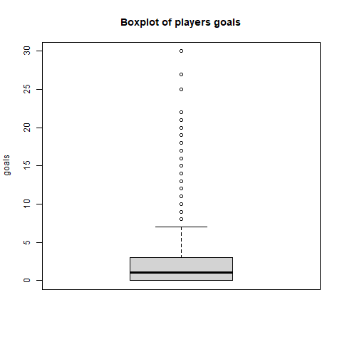
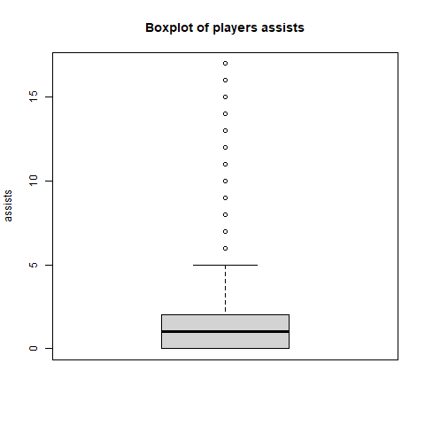

# Pràctica 2: Neteja i anàlisi de les dades

- [Pràctica 2: Neteja i anàlisi de les dades](#pràctica-2-neteja-i-anàlisi-de-les-dades)
  - [0. Requeriments](#0-requeriments)
  - [1. Dataset](#1-dataset)
  - [2. Integració i selecció de les dades d’interès a analitzar](#2-integració-i-selecció-de-les-dades-dinterès-a-analitzar)
    - [2.1. Filtre de variables (columnes)](#21-filtre-de-variables-columnes)
      - [Selecció de columnes](#selecció-de-columnes)
      - [Conversió del tipus del camp `age`](#conversió-del-tipus-del-camp-age)
      - [Transformació sobre la columna `value`](#transformació-sobre-la-columna-value)
    - [2.2. Filtre de jugadors (files)](#22-filtre-de-jugadors-files)
      - [Eliminem files amb `matches == 0`](#eliminem-files-amb-matches--0)
  - [3. Neteja de les dades](#3-neteja-de-les-dades)
    - [3.1. Dades amb zeros i elements buits](#31-dades-amb-zeros-i-elements-buits)
      - [Nombre de files amb columnes amb valor 0](#nombre-de-files-amb-columnes-amb-valor-0)
    - [Nombre de files amb columnes amb valors buits (NA)](#nombre-de-files-amb-columnes-amb-valors-buits-na)
    - [3.2. Identificació i tractament de valors extrems](#32-identificació-i-tractament-de-valors-extrems)
      - [Comprovació de les estadístiques de les variables numèriques:](#comprovació-de-les-estadístiques-de-les-variables-numèriques)
      - [Boxplots in PDF file](#boxplots-in-pdf-file)
      - [Boxplots in PNG files](#boxplots-in-png-files)
  - [4. Anàlisi de les dades.](#4-anàlisi-de-les-dades)
    - [4.1. Selecció dels grups de dades que es volen analitzar/comparar](#41-selecció-dels-grups-de-dades-que-es-volen-analitzarcomparar)
    - [4.2. Comprovació de la normalitat i homogeneïtat de la variància.](#42-comprovació-de-la-normalitat-i-homogeneïtat-de-la-variància)
    - [4.3. Aplicació de proves estadístiques per comparar els grups de dades.](#43-aplicació-de-proves-estadístiques-per-comparar-els-grups-de-dades)
  - [5. Representació dels resultats a partir de taules i gràfiques.](#5-representació-dels-resultats-a-partir-de-taules-i-gràfiques)
  - [6. Resolució del problema.](#6-resolució-del-problema)

## 0. Requeriments

Carreguem els paquets necessaris:
```
> library(tidyverse)
```

## 1. Dataset

Carreguem el dataset des del fitxer:
```
> fitxer_ruta <- '../data/transfermarkt.csv'
> dades <- read.csv(fitxer_ruta)
```

## 2. Integració i selecció de les dades d’interès a analitzar

### 2.1. Filtre de variables (columnes)

#### Selecció de columnes

Generem un nou dataset (`players`) com a resultat del filtre d'eliminar les columnes següents:

  - `url`: columna 4
  - `owngoals`: columna 12
  - `yellowcards`: columna 14
  - `yellow2cards`: columna 15
  - `redcards`: columna 16

```
> players <- dades %>% select(-url, -owngoals, -yellowcards, -yellow2cards, -redcards)
```

#### Conversió del tipus del camp `age`

Convertim el camp `age` en numèric (integer)

```
> class(players$age)
[1] "character"
> players$age <- as.integer(players$age)
Warning message:
NAs introduced by coercion
```

Nota: obtenim un `warning` de coerció. Aquesta advertència ens indica que no s'han pogut convertir tots els valors, i per tant algunes files es quedaran amb `age == NA`. Aquestes dades les tractarem en l'apartat 3.

#### Transformació sobre la columna `value` 

Dividim el valor de la columna `value` per 1.000.000 per a convertir en milions d'euros:

```
> summary(players$value)
     Min.   1st Qu.    Median      Mean   3rd Qu.      Max. 
    75000   1000000   2500000   5700862   5000000 160000000 
> players$value <- players$value / 1e6
> summary(players$value)
   Min. 1st Qu.  Median    Mean 3rd Qu.    Max. 
  0.075   1.000   2.500   5.701   5.000 160.000
```

Comprovem el resultat del filtre i conversions de columnes:

```
> head(players)
  position_id position_ranking                 player   position age  country                club value
1           1                1   Gianluigi Donnarumma Goalkeeper  22    Italy Paris Saint-Germain    65
2           1                2       Thibaut Courtois Goalkeeper  29  Belgium         Real Madrid    65
3           1                3              Jan Oblak Goalkeeper  28 Slovenia Atlético de Madrid    60
4           1                4                Alisson Goalkeeper  29   Brazil        Liverpool FC    60
5           1                5                Ederson Goalkeeper  28   Brazil     Manchester City    50
6           1                6 Marc-André ter Stegen Goalkeeper  29  Germany        FC Barcelona    45
  matches goals assists subston substoff
1      11     0       0       0        0
2      25     0       0       0        0
3      24     0       0       0        0
4      24     0       0       0        0
5      25     0       0       0        0
6      22     0       0       0        0
```

### 2.2. Filtre de jugadors (files)

Comprovem jugadors sense partits (`matches`) és igual a 0):
```
> nrow(players[players$matches == 0,])
[1] 1321
```

Comprovem jugadors amb partits:
```
> nrow(players[!players$matches == 0,])
[1] 5179
```

#### Eliminem files amb `matches == 0`

Eliminem els jugadors sense partits, deixant sols els que tenen partits disputats:

```
> players <- players[!players$matches == 0,]
> nrow(players)
[1] 5179
```

## 3. Neteja de les dades

### 3.1. Dades amb zeros i elements buits

#### Nombre de files amb columnes amb valor 0

```
> sapply(players, function(x) sum(x == 0))
     position_id position_ranking           player         position              age          country 
               0                0                0                0               NA                0 
            club            value          matches            goals          assists          subston 
               0                0                0             2133             2008             1175 
        substoff 
             775
```

Obtenim els següents resultats:

* Les files amb `matches == 0` ja han sigut eliminades en l'apartat 2.
* Les columnes amb valors 0 són: `goals`, `assists`, `subston` i `substoff`. Són valors normals, ja que representen als jugadors que no han puntuat en aquestes estadísiques. No requereixen tractament.
* La columna `age` conté el valor NA, que tractarem al següent apartat.

### Nombre de files amb columnes amb valors buits (NA)

```
> sapply(players, function(x) sum(is.na(x)))
     position_id position_ranking           player         position              age          country 
               0                0                0                0                2                0 
            club            value          matches            goals          assists          subston 
               0                0                0                0                0                0 
        substoff 
               0 
```

Observem que hi ha 2 files amb edat desconeguda (`age == NA`). Consultem aquests jugadors:

```
> nrow(players[is.na(players$age),])
[1] 2
> players[is.na(players$age), ]
     position_id position_ranking           player       position age country             club value matches
3406           8              406 Khaled Al Fadhli Right Midfield  NA  Kuwait        Qadsia SC 0.200       2
5970          13              470    Milos Rosevic Second Striker  NA  Serbia FK Timok Zajecar 0.075      17
     goals assists subston substoff
3406     0       0       0        1
5970     0       1       2        6
```

Atès que es tracta d'un nombre reduït de files (sols 2), creiem que no és necessari utiltizar cap tècnica de tractament de valors desconeguts i podem ignorar-les. Esborrem les files:

```
> nrow(players)
[1] 5179
> nrow(players[!is.na(players$age), ])
[1] 5177
> players <- players[!is.na(players$age), ]
> nrow(players)
[1] 5177
```

### 3.2. Identificació i tractament de valors extrems

Identifiquem les variables numèriques:

```
> columns <- c("age", "value", "matches", "goals", "assists", "subston", "substoff")
> columns
[1] "age"      "value"    "matches"  "goals"    "assists"  "subston"  "substoff"
```

#### Comprovació de les estadístiques de les variables numèriques:

```
> for (column in columns) {
+     print(paste("summary(players$", column, ")", sep =""))
+     print(summary(players[[column]]))
+ }
[1] "summary(players$age)"
   Min. 1st Qu.  Median    Mean 3rd Qu.    Max. 
  16.00   23.00   25.00   25.58   28.00   43.00 
[1] "summary(players$value)"
   Min. 1st Qu.  Median    Mean 3rd Qu.    Max. 
  0.075   1.300   3.000   6.670   6.500 160.000 
[1] "summary(players$matches)"
   Min. 1st Qu.  Median    Mean 3rd Qu.    Max. 
   1.00   12.00   17.00   16.13   21.00   36.00 
[1] "summary(players$goals)"
   Min. 1st Qu.  Median    Mean 3rd Qu.    Max. 
  0.000   0.000   1.000   2.004   3.000  30.000 
[1] "summary(players$assists)"
   Min. 1st Qu.  Median    Mean 3rd Qu.    Max. 
  0.000   0.000   1.000   1.585   2.000  17.000 
[1] "summary(players$subston)"
   Min. 1st Qu.  Median    Mean 3rd Qu.    Max. 
  0.000   1.000   3.000   3.669   6.000  23.000 
[1] "summary(players$substoff)"
   Min. 1st Qu.  Median    Mean 3rd Qu.    Max. 
  0.000   1.000   4.000   4.866   7.000  24.000 
```

#### Boxplots in PDF file

```
> pdf("figures/boxplot.pdf")
> for (column in columns) {
+     title <- paste("Boxplot of players ", column, sep="")
+     boxplot(players[[column]], ylab=column, main=title)
+ }
> dev.off()
RStudioGD 
        2 
```

#### Boxplots in PNG files
```
> for (column in columns) {
+     title <- paste("Boxplot of players ", column, sep="")
+     pngfile <- paste("figures/boxplot-", column, ".png", sep="")
+     
+     png(pngfile)
+     boxplot(players[[column]], ylab=column, main=title)
+     dev.off()
+     
+     imglink <- paste("", sep="")
+     print(imglink)
+ }
[1] ""
[1] ""
[1] ""
[1] ""
[1] ""
[1] ""
[1] ""
```

Resultat: 


## 4. Anàlisi de les dades.

### 4.1. Selecció dels grups de dades que es volen analitzar/comparar 

(planificació dels anàlisis a aplicar).

### 4.2. Comprovació de la normalitat i homogeneïtat de la variància.

### 4.3. Aplicació de proves estadístiques per comparar els grups de dades. 

En funció de les dades i de l’objectiu de l’estudi, aplicar proves de contrast d’hipòtesis, correlacions, regressions, etc. Aplicar almenys tres mètodes d’anàlisi diferents. 

## 5. Representació dels resultats a partir de taules i gràfiques.

## 6. Resolució del problema.

