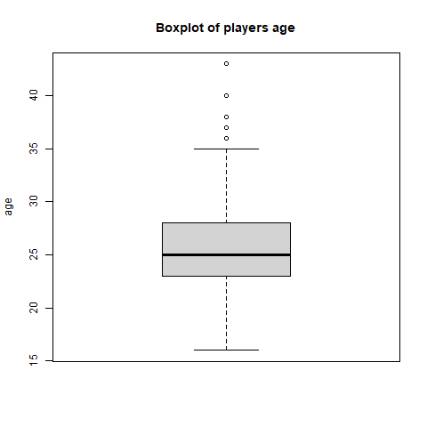
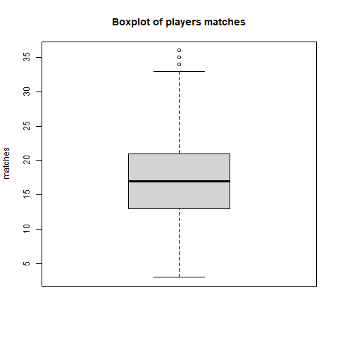

## Dataset original

Dataset original: 
* Fitxer: `data/transfermarkt.csv`
* Descripció: resultat de la pràctica #1
* Tipus de dades de les columnes.

| column           | type      |
|------------------|-----------|
| position_id      | integer   |
| position_ranking | integer   |
| player           | character |
| url              | character |
| position         | character |
| age              | character |
| country          | character |
| club             | character |
| value            | integer   |
| matches          | integer   |
| goals            | integer   |
| owngoals         | integer   |
| assists          | integer   |
| yellowcards      | integer   |
| yellow2cards     | integer   |
| redcards         | integer   |
| subston          | integer   |
| substoff         | integer   |

Accions a realitzar:
* Cal modificar el tipus del camp `age` a numèric (integer).

## Codi per carregar les dades

### Carreguem els paquets necessaris:
```
> library(tidyverse)
```

### Carreguem el dataset des del fitxer:
```
> fitxer_ruta <- '../data/transfermarkt.csv'
> dades <- read.csv(file - fitxer_ruta)
```

## Codi per a les comprovacions inicials

### Comprovem les primeres files:
```
> head(dades)
  position_id position_ranking                 player                                         url   position
1           1                1   Gianluigi Donnarumma /gianluigi-donnarumma/profil/spieler/315858 Goalkeeper
2           1                2       Thibaut Courtois     /thibaut-courtois/profil/spieler/108390 Goalkeeper
3           1                3              Jan Oblak            /jan-oblak/profil/spieler/121483 Goalkeeper
4           1                4                Alisson              /alisson/profil/spieler/105470 Goalkeeper
5           1                5                Ederson              /ederson/profil/spieler/238223 Goalkeeper
6           1                6 Marc-André ter Stegen /marc-andre-ter-stegen/profil/spieler/74857 Goalkeeper
  age  country                club    value matches goals owngoals assists yellowcards yellow2cards redcards
1  22    Italy Paris Saint-Germain 65000000      11     0        0       0           2            0        0
2  29  Belgium         Real Madrid 65000000      25     0        0       0           1            0        0
3  28 Slovenia Atlético de Madrid 60000000      24     0        0       0           0            0        0
4  29   Brazil        Liverpool FC 60000000      24     0        1       0           0            0        0
5  28   Brazil     Manchester City 50000000      25     0        0       0           2            0        0
6  29  Germany        FC Barcelona 45000000      22     0        0       0           3            0        0
  subston substoff
1       0        0
2       0        0
3       0        0
4       0        0
5       0        0
6       0        0
```

### Comprovem el tipus de dades les columnes:
```
> sapply(dades, function(x) class(x))
     position_id position_ranking           player              url         position              age 
       "integer"        "integer"      "character"      "character"      "character"      "character" 
         country             club            value          matches            goals         owngoals 
     "character"      "character"        "integer"        "integer"        "integer"        "integer" 
         assists      yellowcards     yellow2cards         redcards          subston         substoff 
       "integer"        "integer"        "integer"        "integer"        "integer"        "integer" 
```


### Generem un nou dataset (`players`) com a resultat del filtre d'eliminar la quarta columan (url):
```
> players <- dades[, -(4)]
```

### Comprovem les primeres files:
```
> head(players)
  position_id position_ranking                 player   position age  country                club    value
1           1                1   Gianluigi Donnarumma Goalkeeper  22    Italy Paris Saint-Germain 65000000
2           1                2       Thibaut Courtois Goalkeeper  29  Belgium         Real Madrid 65000000
3           1                3              Jan Oblak Goalkeeper  28 Slovenia Atlético de Madrid 60000000
4           1                4                Alisson Goalkeeper  29   Brazil        Liverpool FC 60000000
5           1                5                Ederson Goalkeeper  28   Brazil     Manchester City 50000000
6           1                6 Marc-André ter Stegen Goalkeeper  29  Germany        FC Barcelona 45000000
  matches goals owngoals assists yellowcards yellow2cards redcards subston substoff
1      11     0        0       0           2            0        0       0        0
2      25     0        0       0           1            0        0       0        0
3      24     0        0       0           0            0        0       0        0
4      24     0        1       0           0            0        0       0        0
5      25     0        0       0           2            0        0       0        0
6      22     0        0       0           3            0        0       0        0

```

### Nombre de files amb valor 0 per cada columna:
```
> sapply(players, function(x) sum(x == 0))
     position_id position_ranking           player         position              age          country 
               0                0                0                0                0                0 
            club            value          matches            goals         owngoals          assists 
               0                0             1321             3454             6336             3329 
     yellowcards     yellow2cards         redcards          subston         substoff 
            2503             6245             6222             2496             2096 
```

### Comprovem jugadors sense partits (`matches` és igual a 0):
```
> nrow(players[players$matches == 0,])
[1] 1321
```

### Comprovem jugadors amb partits:
```
> nrow(players[!players$matches == 0,])
[1] 5179
```

### Eliminem els jugadors sense partits, deixant sols els que tenen partits disputats:
```
> players <- players[!players$matches == 0,]
> nrow(players)
[1] 5179
```

### Modifiquem la columna 'value' passant-la a milions d'euros
```
> summary(players$value)
     Min.   1st Qu.    Median      Mean   3rd Qu.      Max. 
    75000   1300000   3000000   6667334   6500000 160000000 
> players$value <- players$value / 1000000
> summary(players$value)
   Min. 1st Qu.  Median    Mean 3rd Qu.    Max. 
  0.075   1.300   3.000   6.667   6.500 160.000 
  ```

### Convertim el camp 'age' en numèric (integer)
```
> players$age <- as.integer(players$age)
Warning message:
NAs introduced by coercion
```

### Valors desconeguts per cada columna:
```
> sapply(players, function(x) sum(is.na(x)))
     position_id position_ranking           player         position 
               0                0                0                0 
             age          country             club            value 
               2                0                0                0 
         matches            goals         owngoals          assists 
               0                0                0                0 
     yellowcards     yellow2cards         redcards          subston 
               0                0                0                0 
        substoff 
               0 
```
### Jugadors amb valor desconegut per al camp 'age':
```
> nrow(players[is.na(players$age),])
[1] 2
> players[is.na(players$age), ]
     position_id position_ranking           player       position age country
3406           8              406 Khaled Al Fadhli Right Midfield  NA  Kuwait
5970          13              470    Milos Rosevic Second Striker  NA  Serbia
                 club value matches goals owngoals assists yellowcards
3406        Qadsia SC 0.200       2     0        0       0           0
5970 FK Timok Zajecar 0.075      17     0        0       1           3
     yellow2cards redcards subston substoff
3406            0        0       0        1
5970            0        0       2        6
```

### Filtrem el dataset llevant les files amb valor desconegut per al camp 'age'
```
> nrow(players[!is.na(players$age), ])
[1] 5177
> players <- players[!is.na(players$age), ]
> nrow(players)
[1] 5177
```

### Nombre de files amb valor 0 per cada columna
```
> sapply(players, function(x) sum(x == 0))
     position_id position_ranking           player         position 
               0                0                0                0 
             age          country             club            value 
               0                0                0                0 
         matches            goals         owngoals          assists 
               0             2131             5013             2007 
     yellowcards     yellow2cards         redcards          subston 
            1181             4922             4899             1174 
        substoff 
             775 
```

## Codi per estadísitiques descriptives

### Variables numèriques:
```
> columns <- c("age", "value", "matches", "goals", "owngoals", "assists", "yellowcards", "yellow2cards", "redcards", "subston", "substoff")
> columns
 [1] "age"          "value"        "matches"      "goals"       
 [5] "owngoals"     "assists"      "yellowcards"  "yellow2cards"
 [9] "redcards"     "subston"      "substoff" 
```

### Comprovació de les estadístiques:
```
> for (column in columns) {
+     print(paste("summary(players$", column, ")", sep =""))
+     print(summary(players[[column]]))
+ }
[1] "summary(players$age)"
   Min. 1st Qu.  Median    Mean 3rd Qu.    Max. 
  16.00   23.00   25.00   25.58   28.00   43.00 
[1] "summary(players$value)"
   Min. 1st Qu.  Median    Mean 3rd Qu.    Max. 
  0.075   1.300   3.000   6.670   6.500 160.000 
[1] "summary(players$matches)"
   Min. 1st Qu.  Median    Mean 3rd Qu.    Max. 
   1.00   12.00   17.00   16.13   21.00   36.00 
[1] "summary(players$goals)"
   Min. 1st Qu.  Median    Mean 3rd Qu.    Max. 
  0.000   0.000   1.000   2.004   3.000  30.000 
[1] "summary(players$owngoals)"
   Min. 1st Qu.  Median    Mean 3rd Qu.    Max. 
0.00000 0.00000 0.00000 0.03245 0.00000 2.00000 
[1] "summary(players$assists)"
   Min. 1st Qu.  Median    Mean 3rd Qu.    Max. 
  0.000   0.000   1.000   1.585   2.000  17.000 
[1] "summary(players$yellowcards)"
   Min. 1st Qu.  Median    Mean 3rd Qu.    Max. 
  0.000   1.000   2.000   2.097   3.000  11.000 
[1] "summary(players$yellow2cards)"
   Min. 1st Qu.  Median    Mean 3rd Qu.    Max. 
0.00000 0.00000 0.00000 0.05177 0.00000 2.00000 
[1] "summary(players$redcards)"
   Min. 1st Qu.  Median    Mean 3rd Qu.    Max. 
0.00000 0.00000 0.00000 0.05409 0.00000 2.00000 
[1] "summary(players$subston)"
   Min. 1st Qu.  Median    Mean 3rd Qu.    Max. 
  0.000   1.000   3.000   3.669   6.000  23.000 
[1] "summary(players$substoff)"
   Min. 1st Qu.  Median    Mean 3rd Qu.    Max. 
  0.000   1.000   4.000   4.866   7.000  24.000
```

## Identificar outliers:

### Boxplots in PDF file
```
> pdf("figures/boxplot.pdf")
> for (column in columns) {
+     title <- paste("Boxplot of players ", column, sep="")
+     boxplot(players[[column]], ylab=column, main=title)
+ }
> dev.off()
RStudioGD 
        2 
```

### Boxplots in PNG files
```
> for (column in columns) {
+     title <- paste("Boxplot of players ", column, sep="")
+     pngfile <- paste("figures/boxplot-", column, ".png", sep="")
+     
+     png(pngfile)
+     boxplot(players[[column]], ylab=column, main=title)
+     dev.off()
+     
+     imglink <- paste("", sep="")
+     print(imglink)
+ }
[1] ""
[1] ""
[1] ""
[1] ""
[1] ""
[1] ""
[1] ""
[1] ""
[1] ""
[1] ""
[1] ""
```






